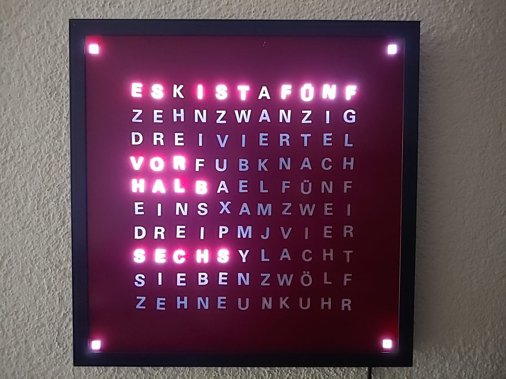
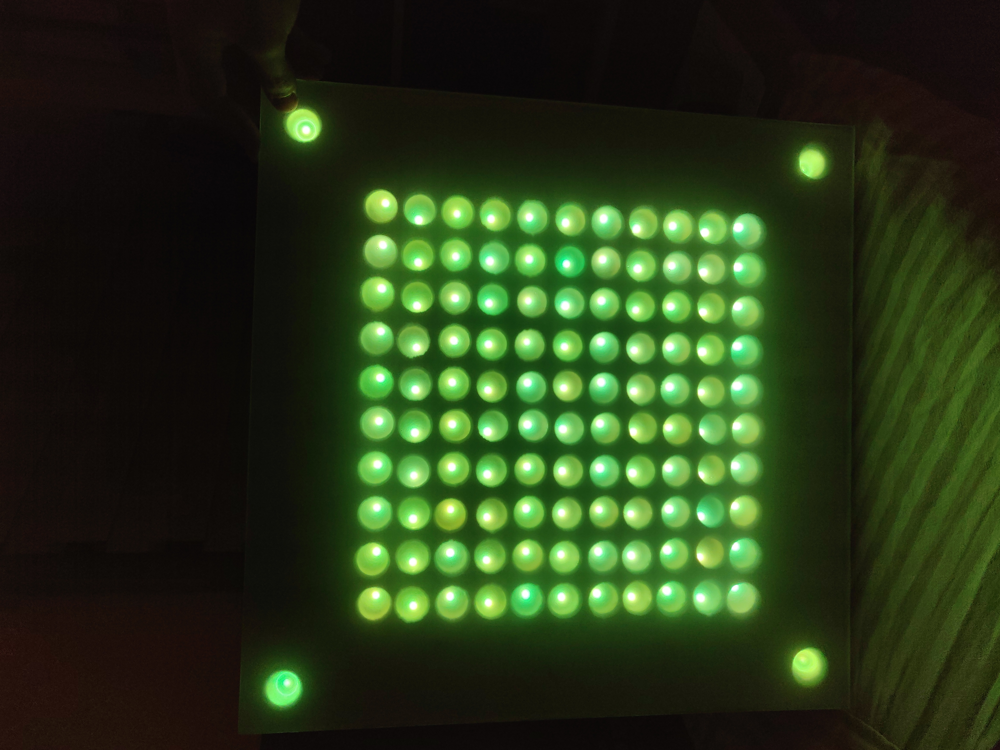
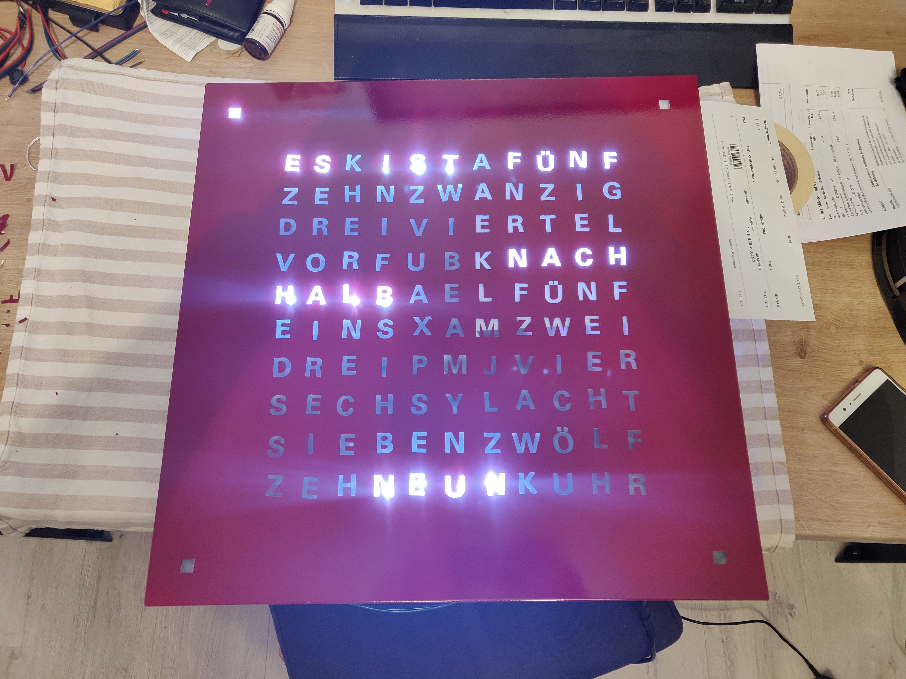

<h1 align="center">
  QLock
</h1>

<h4 align="center">
  Word clock powered by raspberrypi and python with mqtt support
</h4>

<div align="center">
  
</div>

<div align="center">
  <a href="https://play.google.com/store/apps/details?id=dev.tpoe.wordclock&hl=en&gl=US">
    
  </a>

  <a href="https://play.google.com/store/apps/details?id=dev.tpoe.wordclock&hl=en&gl=US">
    
  </a>
</div>

## Android Watch Face and Widget

The word clock is now available as a Wear OS Watch Face and as an Android widget. Check out the links above.

## Highlights
- Multiple Transitions (simple, fade, matrix)
- MQTT support 

## Contents

- [Description](#description)
- [Highlights](#highlights)
- [Install](#install)
- [Usage](#usage)
- [Configuration](#configuration)
- [Images](#images)
- [Development](#development)
- [Team](#team)
- [License](#license)

## Install

Run following command to install all dependencies

``` bash
sudo apt-get install python3-numpy
pip install -r requirements.txt
pip install RPi.GPIO
pip install adafruit-ws2801
```

## Usage

## Configuration

to configure qlock modify the config.json in the root directory. The following illustrates all the available options with their respective default values.

``` json
{
  "environment": "prod",
  "tick_interval": 5,
  "color": [255, 255, 255],
  "transition": "fade",
  "mqtt": {
    "active": true,
    "host": "192.168.0.2",
    "port": 1883,
    "user": "",
    "password": "",
    "topic": "qlock"
  },
  "opt3001": {
    "active": true,
    "address": "0x44",
    "bus": 1,
    "max_brightness_percentage": 100,
    "min_brightness_percentage": 30,
    "max_brightness_threshold": 2000,
    "min_brightness_threshold": 500,
  },
  "special_interval": 60,
  "dates": [{
    "date": "21.06",
    "text": "HAPPYBIRTHDAYPAPA"
  }, {
    "date": "27.09",
    "text": "HAPPYBIRTHDAYMAMA"
  }]
}
```

### In Detail

#### environment

- Type: String
- Values: `dev`,`prod`

#### tick_interval

- Type: Int
- Unit: Seconds

Time between clock ticks in seconds

#### color

- Type: Array

Color of the LEDs.

#### transition

- Type: String
- Values: `simple`,`fade`,`matrix`

Transition between different words

#### mqtt

- Type: Object

MQTT related settings

#### opt3001

- Type: Object

Opt3001(Lightsensor) related settings

#### dates

- Type: Array
- Default: []

Special Dates like birthdays can be configured here. The clock will write the given text at this date to the screen.

<div align="center">
  
</div>

## Images

<div align="center">
  
</div>

<div align="center">
  
</div>

<div align="center">
  
</div>

<div align="center">
  
</div>

<div align="center">
  
</div>

<div align="center">
  
</div>

<div align="center">
  
</div>

<div align="center">
  
</div>

## Development

For local development on a non raspberry pi system you have to comment out the controller import. Because the GPIO packages are only available on a raspberry pi.

### Unittests
``` bash
python3 -m unittest -v
```

## Team

- Thomas Pöhlmann [(@perryrh0dan)](https://github.com/perryrh0dan)

## License

[MIT](https://github.com/perryrh0dan/qlock/blob/master/license.md)

